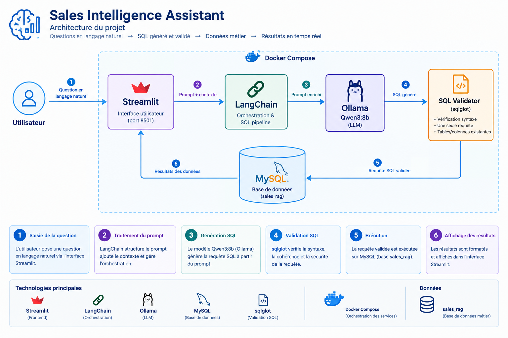

# Sales Intelligence Assistant

Assistant d'intelligence commerciale permettant d'interroger des données de vente en langage naturel.

Le projet combine trois approches :

* **SQL** : génération et exécution de requêtes SQL sur les données commerciales.
* **RAG** : recherche sémantique dans les règles et définitions métier.
* **HYBRID** : combinaison de la connaissance métier RAG et des données SQL.

Technologies principales :

* Python
* Streamlit
* Docker
* MySQL
* Ollama
* Qwen
* ChromaDB
* LangChain

---

## Fonctionnalités

### SQL

Le mode SQL permet notamment de répondre à des questions comme :

* Quel est le chiffre d'affaires total ?
* Combien y a-t-il de commandes annulées ?
* Quels sont les clients Gold ?
* Quel est le montant moyen des commandes livrées ?
* Quelles commandes dépassent 1 000 € ?
* Combien de commandes sont associées à chaque commercial ?

### RAG

Le mode RAG permet d'interroger les règles métier :

* Comment est calculé le chiffre d'affaires ?
* Les commandes annulées sont-elles incluses ?
* Comment déterminer le meilleur client ?
* Quelle est la règle de réapprovisionnement ?
* Que signifie `discount_percent` ?

Le système doit également savoir reconnaître lorsqu'une information n'est pas présente dans les documents et éviter de l'inventer.

### HYBRID

Le mode HYBRID combine :

1. les règles métier récupérées par RAG ;
2. les données réelles récupérées par SQL.

Exemple :

> Quel est le meilleur client ?

Le RAG fournit la définition du meilleur client et SQL fournit le résultat calculé à partir des données.

---

## Architecture

```text
                         ┌─────────────────┐
                         │     Streamlit   │
                         │   Interface UI  │
                         └────────┬────────┘
                                  │
                    ┌─────────────┼─────────────┐
                    │             │             │
                    ▼             ▼             ▼
                  SQL            RAG          HYBRID
                    │             │             │
                    ▼             ▼             │
                  MySQL      Documents MD       │
                                  │             │
                                  ▼             │
                              Chunking           │
                                  │             │
                                  ▼             │
                         Ollama Embeddings       │
                                  │             │
                                  ▼             │
                              ChromaDB            │
                                  │             │
                                  └──────┬──────┘
                                         ▼
                                  Ollama / Qwen
```

---

## Structure du projet

Structure principale :

```text
Sales_Intelligence_Assistant/
│
├── app/
│   ├── integration/
│   │   ├── generator_rag.py
│   │   └── generator_with_rag.py
│   │
│   ├── rag/
│   │   ├── documents.py
│   │   ├── splitters.py
│   │   ├── embeddings.py
│   │   ├── retriever.py
│   │   └── vectorstore.py
│   │
│   └── ...
│
├── rag_documents/
│   ├── business_rules.md
│   ├── customer_definitions.md
│   ├── product_definitions.md
│   └── sales_definitions.md
│
├── tests/
│   ├── test_documents.py
│   ├── test_splitter.py
│   └── test_vector_store.py
│
├── Dockerfile
├── requirements.txt
├── README.md
└── ...
```

---

## Règles métier principales

### Chiffre d'affaires

Le chiffre d'affaires d'une ligne de commande est calculé avec :

```text
quantity * unit_price * (1 - discount_percent / 100)
```

Le chiffre d'affaires total est :

```text
SUM(
    quantity
    * unit_price
    * (1 - discount_percent / 100)
)
```

Les commandes annulées sont exclues.

### `discount_percent`

`discount_percent` représente le pourcentage de remise appliqué au prix de la ligne de commande.

Exemples :

```text
0  → aucune remise
10 → remise de 10 %
20 → remise de 20 %
```

### Meilleur client

Le meilleur client est celui qui possède le chiffre d'affaires le plus élevé.

Les commandes annulées sont exclues.

### Meilleur commercial

Le meilleur commercial est celui qui possède le chiffre d'affaires le plus élevé pour les commandes qui lui sont attribuées.

Les commandes annulées sont exclues.

### Produit le plus vendu

Le produit le plus vendu est celui dont la quantité totale vendue est la plus importante.

```text
SUM(order_items.quantity)
```

Les commandes annulées sont exclues.

### Réapprovisionnement

Un produit doit être réapprovisionné lorsque :

```text
stock_quantity < reorder_level
```

---

## RAG

### Documents métier

Les documents utilisés par le RAG sont stockés dans :

```text
rag_documents/
```

Ils contiennent notamment :

* les règles métier ;
* les définitions clients ;
* les définitions produits ;
* les définitions des ventes.

### Découpage

Les documents Markdown sont chargés avec `TextLoader`.

Ils sont ensuite découpés avec :

* `MarkdownHeaderTextSplitter`
* `RecursiveCharacterTextSplitter`

Configuration actuelle :

```text
CHUNK_SIZE = 800
CHUNK_OVERLAP = 100
```

### Embeddings

Les embeddings sont générés avec :

```text
nomic-embed-text
```

via Ollama.

### ChromaDB

Collection utilisée :

```text
rag_collection_sales
```

Nombre actuel de chunks :

```text
28
```

---

## Reconstruction de l'index RAG

Après modification des documents dans `rag_documents/`, il faut reconstruire l'index vectoriel.

Entrer dans le conteneur :

```bash
docker exec -it sales-intelligence-assistant sh
```

Supprimer uniquement la collection RAG :

```bash
PYTHONPATH=/app python -c "import chromadb; c=chromadb.PersistentClient(path='chroma_db'); print('Avant :', c.get_collection('rag_collection_sales').count()); c.delete_collection('rag_collection_sales'); print('Collection supprimée')"
```

Reconstruire les embeddings :

```bash
PYTHONPATH=/app python -m tests.test_vector_store
```

Vérifier le nombre de documents :

```bash
PYTHONPATH=/app python -c "from app.rag.vectorstore import count_vectors; print('Nombre de documents dans Chroma :', count_vectors())"
```

Résultat attendu :

```text
Nombre de documents dans Chroma : 28
```

Après suppression et recréation d'une collection Chroma, redémarrer Streamlit :

```bash
exit
docker restart sales-intelligence-assistant
```

---

## Tester le retrieval

Depuis le conteneur :

```bash
PYTHONPATH=/app python -c "from app.rag.retriever import retrieve_question; retrieve_question('Quelle est la formule exacte du chiffre d’affaires, y compris les remises ?', 3)"
```

Le contexte doit notamment contenir :

```text
quantity * unit_price * (1 - discount_percent / 100)
```

ainsi que :

```text
Les commandes annulées sont exclues.
```

---

## Tester directement le générateur RAG

Le générateur se trouve actuellement dans :

```text
app/integration/generator_rag.py
```

Test :

```bash
PYTHONPATH=/app python -c "from app.rag.retriever import retrieve_question; from app.integration.generator_rag import generate_rag_answer; q='Quelle est la formule exacte du chiffre d’affaires, y compris les remises ?'; c=retrieve_question(q,3); print(generate_rag_answer(q,c))"
```

Réponse attendue :

```text
quantity × unit_price × (1 - discount_percent / 100)
```

avec l'exclusion des commandes annulées.

---

## Base de données

Le projet utilise une base MySQL contenant notamment :

* les clients ;
* les commandes ;
* les lignes de commande ;
* les produits ;
* les commerciaux.

La base existante ne doit pas être réinitialisée lors de la maintenance du RAG.

Les opérations effectuées sur ChromaDB concernent uniquement l'index vectoriel et ne modifient pas les données MySQL.

---

## Résultats de référence

Sur le jeu de données actuel :

```text
Nombre total de commandes : 40
Commandes annulées : 1
Commandes livrées : 39
Chiffre d'affaires livré : 85 270 €
Moyenne d'une commande livrée : 2 186,41 €
```

Ces valeurs servent notamment de références pour les tests SQL.

---

## Tests fonctionnels

### Tests SQL

Les tests réalisés couvrent notamment :

* nombre total de commandes ;
* commandes annulées ;
* commandes livrées ;
* commandes supérieures à 1 000 € ;
* commandes par commercial ;
* commandes de décembre 2024 ;
* clients Gold ;
* clients Premium ;
* types de clients ;
* chiffre d'affaires livré ;
* moyenne des commandes livrées ;
* commandes annulées par commercial ;
* clients associés à des commandes annulées.

### Tests RAG

Les tests réalisés couvrent :

1. Formule du chiffre d'affaires avec remise.
2. Signification de `discount_percent`.
3. Exclusion des commandes annulées.
4. Règle de réapprovisionnement.
5. Détermination du meilleur client.
6. Question hors contexte sur la politique de retour.

Pour une question hors contexte, le système doit indiquer que l'information n'est pas disponible plutôt que d'inventer une réponse.

### Tests HYBRID

Le mode HYBRID a notamment été testé avec une question sur le meilleur client.

Résultat obtenu sur le jeu de données actuel :

```text
ABC Consulting
Chiffre d'affaires : 12 890
```

---

## Docker

Construire l'image :

```bash
docker build -t sales-intelligence-assistant .
```

Lancer le conteneur :

```bash
docker run -d \
  --name sales-intelligence-assistant \
  -p 8501:8501 \
  sales-intelligence-assistant
```

L'application Streamlit est ensuite disponible sur :

```text
http://localhost:8501
```

Pour redémarrer un conteneur existant :

```bash
docker restart sales-intelligence-assistant
```

---

## Configuration

Les connexions à MySQL et Ollama utilisent des variables d'environnement.

Exemple :

```text
DB_HOST=host.docker.internal
DB_NAME=sales_rag
OLLAMA_BASE_URL=http://localhost:11434
```

Les mots de passe, clés API et autres secrets ne doivent jamais être ajoutés au dépôt Git.

Utiliser un fichier `.env` local si nécessaire et l'exclure du versionnement.

---

## Dépannage

### `Collection does not exist`

Si Chroma affiche une erreur du type :

```text
Collection [...] does not exist
```

après une suppression/recréation de collection, Streamlit peut encore avoir une ancienne instance de collection en mémoire.

Redémarrer le conteneur :

```bash
docker restart sales-intelligence-assistant
```

### `ModuleNotFoundError`

Les tests doivent être exécutés depuis le conteneur avec :

```bash
PYTHONPATH=/app
```

Exemple :

```bash
PYTHONPATH=/app python -m tests.test_vector_store
```

### `grep` n'est pas reconnu dans PowerShell

`grep` est utilisé dans le conteneur Linux.

Entrer dans le conteneur :

```bash
docker exec -it sales-intelligence-assistant sh
```

Puis :

```bash
grep -R -n "quantity.*unit_price" /app/rag_documents
```

---

## Bonnes pratiques

* Ne pas réinitialiser la base MySQL pour reconstruire le RAG.
* Modifier les documents métier avant de reconstruire Chroma.
* Éviter les définitions métier contradictoires.
* Reconstruire les embeddings après modification des documents.
* Redémarrer Streamlit après suppression/recréation de la collection Chroma.
* Tester le retrieval avant de modifier le générateur.
* Tester des questions hors contexte.
* Ne jamais versionner les secrets.
* Vérifier `git status` avant chaque push.

---

## Vérifications avant Git Push

Avant de pousser :

```bash
git status
```

Vérifier qu'aucun secret n'est présent :

```text
.env
credentials
passwords
API keys
tokens
```

Vérifier également les fichiers temporaires :

```text
__pycache__/
*.pyc
```

Selon la stratégie de versionnement choisie, l'index local `chroma_db/` peut être exclu du dépôt et reconstruit à partir des documents.

---

## État actuel du projet

Le pipeline principal est fonctionnel :

```text
SQL       ✅
RAG       ✅
HYBRID    ✅
Streamlit ✅
ChromaDB  ✅
Ollama    ✅
Qwen      ✅
```

Le pipeline RAG a été validé de bout en bout :

```text
Documents métier
       ↓
Chunking
       ↓
Embeddings
       ↓
ChromaDB
       ↓
Retrieval
       ↓
Qwen / Ollama
       ↓
Réponse Streamlit
```


